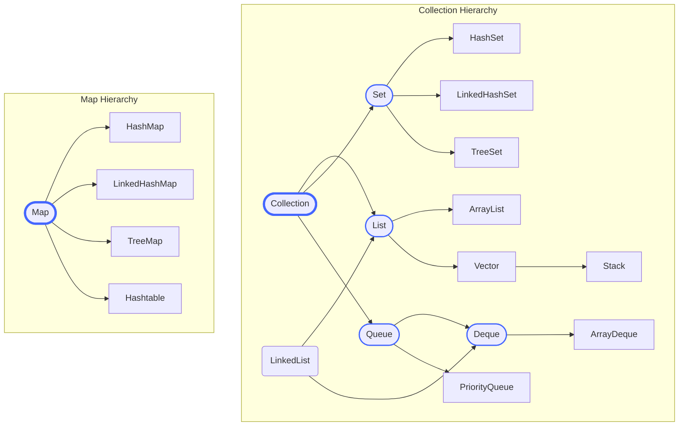

# 1.1 Collection Framework Architecture 🏛️

Hello mawa! Welcome to our first topic. Ikkada manam Java Collections Framework (JCF) ki foundation veddam.

Imagine nuvvu oka pedda library build chestunnav. Books ni organize cheyadaniki neeku oka system kavali kada? Shelf lu, categories, labels... ilantivi. Java lo, aah system ye **Collections Framework**. It gives us a standard way to store and handle groups of objects.

### 🤔 Why Start Here? (Enduku ikkadanunchi start cheyyali?)

Ee hierarchy (structure) ardham chesukovadam chala critical. Endukante manam mundu nerchukoboye prathi class ([`ArrayList`](../../02-List-Interface/2-ArrayList/README.md), [`HashSet`](../../03-Set-Interface/2-HashSet/README.md), [`HashMap`](../../05-Map-Interface/2-HashMap/README.md), etc.) deeni meedha ne base ayyi untadi. Idi ardham aithe, migathavi easy ga grasp cheyochu. It's like learning the alphabet before forming words.

---

## The Big Picture: JCF Hierarchy

Java lo collections anni a main ga ee two hierarchies kindha vastayi.

1.  **[`Collection`](#methods-of-the-collection-interface) Interface**: Deenikindha lists, sets, and queues untai. Idi group of individual objects ni represent chestundi.
2.  **[`Map`](../../05-Map-Interface/README.md) Interface**: Idi `key-value` pairs ni store chestundi. Idi `Collection` hierarchy lo part kaadu, adi separate.

Kindha unna diagram chudu, neeku clear ga ardham avtundi.



---

### 🔑 Key Points (Mukhyamaina Vishayalu)

Ee diagram nunchi manam em nerchukovali?

1.  **Unified Architecture (అంతా ఒకే గొడుగు కింద):** JCF provides a standard architecture. Ante, [`ArrayList`](../../02-List-Interface/2-ArrayList/README.md) lo unna `add()` method, [`HashSet`](../../03-Set-Interface/2-HashSet/README.md) lo unna `add()` method oke la pani chestayi (conceptually). This makes our life easy.

2.  **Interfaces (Blueprints 📜):** [`List`](../../02-List-Interface/README.md), [`Set`](../../03-Set-Interface/README.md), [`Queue`](../../04-Queue-Interface/README.md), [`Map`](../../05-Map-Interface/README.md) lanti vi **interfaces**. Ante, ivi ਕੇవలం rules cheptayi (e.g., "List ante ordered ga undali"), kani actual implementation undadu. Think of them as a blueprint for a building.

3.  **Implementations (Actual Buildings 🏗️):** [`ArrayList`](../../02-List-Interface/2-ArrayList/README.md), [`HashSet`](../../03-Set-Interface/2-HashSet/README.md), [`HashMap`](../../05-Map-Interface/2-HashMap/README.md) lanti vi **concrete classes** (implementations). Ivi aa interface rules ni follow avutu, actual logic ni implement chestayi. So, `ArrayList` is the actual building built from the `List` blueprint.

4.  **Generics for Type Safety (`<String>`):** `< >` ee brackets chusara? వీటిని generics antaru. `List<String> names = new ArrayList<>();` ante, aa list lo kevalam `String` objects matrame store cheyagalam. Vere type (like Integer) add cheyabothe, compiler error vastundi. Idi chala powerful feature to avoid mistakes.

---

### ✨ Methods of the `Collection` Interface

`Collection` anedi ee framework ki root interface. Deenilo unna methods ni 2 categories ga chuddam.

#### 1. Abstract Methods (The Contract 📜)
Ee methods ni prathi concrete implementation class (`ArrayList`, `HashSet`, etc.) **kacchitanga implement cheyyali**. Ivi aa class yokka core functionality ni define chestayi.
*   `int size()`: Collection lo enni elements unnayo cheptundi.
*   `boolean isEmpty()`: Collection empty ga unda leda ani cheptundi.
*   `boolean contains(Object o)`: Element unda leda ani check chestundi.
*   `boolean add(E e)`: Element ni add chestundi.
*   `boolean remove(Object o)`: Element ni remove chestundi.
*   `Iterator<E> iterator()`: Collection meeda iterate cheyadaniki [`Iterator`](../2-Iterator-Pattern/README.md) object ni istundi. (This is our next topic!)
*   `void clear()`: Anni elements ni remove chestundi.
*   ... and more like `boolean containsAll(Collection<?> c)`, `boolean addAll(Collection<? extends E> c)`, `boolean removeAll(Collection<?> c)`, `boolean retainAll(Collection<?> c)`, `Object[] toArray()`.

#### 2. Default Methods (The Free Helpers 🎁 - Java 8+)
Ee methods ki implementation direct ga `Collection` interface lone raasi untadi. So, `ArrayList` lanti classes veetini malli implement cheyalsina avasaram ledu, free ga vachesinatte!
*   `boolean removeIf(Predicate filter)` `(default)`: Oka condition (predicate) match ayye anni elements ni easy ga remove chestundi. Idi chala code ni thaggistundi.
    ```java
    // Example: Remove all even numbers from a list
    List<Integer> numbers = new ArrayList<>(Arrays.asList(1, 2, 3, 4, 5, 6));
    numbers.removeIf(n -> n % 2 == 0); // Short, clean, and expressive!
    // numbers is now [1, 3, 5]
    ```
*   `Stream<E> stream()` `(default)`: Collection ni `Stream` la convert chestundi, data processing kosam chala powerful.
*   `Stream<E> parallelStream()` `(default)`: `Stream` laantide, kani operations ni parallel ga cheyyadaniki try chestundi.
*   `Spliterator<E> spliterator()` `(default)`: `iterator` ki advanced version, parallel processing kosam use avtundi.

That's it for the architecture! Ee foundation tho, manam munduku velli prathi collection ni detail ga chuddam. Next up: **Iterators**! 🔄
