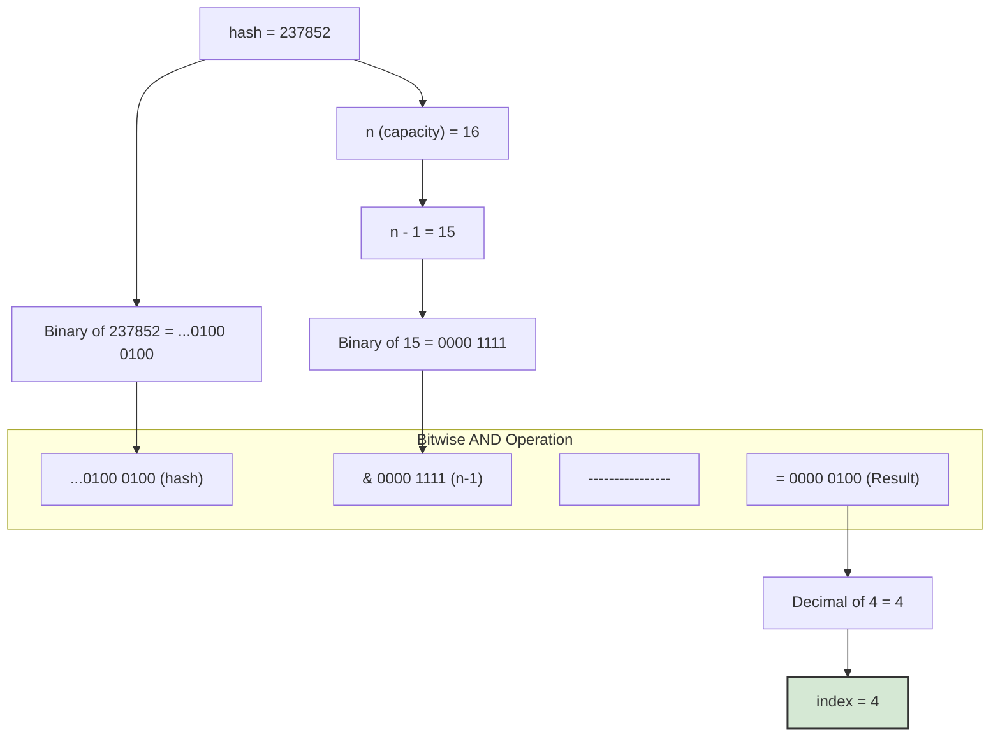

# 🚀 HashMap Internals: A Deep Dive 🧠

Mawa, `HashMap` interviews lo adige most favourite question ki welcome! "How does HashMap work internally?" ee okka question tho nee problem-solving skills, data structures knowledge, and concurrency basics anni test chestaru.

Ee guide lo, manam `HashMap` loni prathi screw ni vippadeesi chuddam. By the end, you'll be able to explain it better than the interviewer!

## The Core Concepts

`HashMap` anedi 3 core concepts meeda build cheyabadi undi:
1.  **Hashing (`hashCode()`)**: Data ki oka unique numerical identity ivvadam.
2.  **Buckets (The Array)**: Aa data ni store chese array slots.
3.  **Collision Handling (`equals()`)**: Oke bucket lo multiple items ni manage cheyadam.

Let's break them down.

---

## 1. The `put(key, value)` Method: The Heart of HashMap

Ikkada nunchi mana journey start avtundi. `map.put("Jules", 101)` ani call cheste, kindha cheppina steps jarugutayi.

### Step 1: The Key's `hashCode()`

First, `HashMap` mana key (`"Jules"`) meeda `hashCode()` method ni call chestundi.

```java
int hash = key.hashCode(); // Example: "Jules".hashCode() -> 237852
```

Ee `hashCode()` method prathi object ki oka integer number ni istundi. A well-implemented `hashCode()` method should return the same number for the same object every time, and different numbers for different objects as much as possible.

**Important:** `HashMap` does one more thing. It takes this hash and does some extra bit-shifting magic on it. Why? To prevent poorly implemented `hashCode()` functions from causing too many collisions. Ee operation `hashCode()` loni upper bits yokka influence ni lower bits meedaki teeskostundi. This ensures a better, more uniform distribution of keys across the buckets.

```java
// Simplified view of what HashMap does
static final int hash(Object key) {
    int h;
    return (key == null) ? 0 : (h = key.hashCode()) ^ (h >>> 16);
}
```
Ee final `hash` value ni next step lo use cheskuntam.

### Step 2: The Index Calculation

Ippudu `HashMap` ki `hash` value undi. Kani daaniki 16 (default size) buckets unna array lo, ee key-value pair ni ekkada pettalo teliyali. Daanikosam, ee `hash` ni oka array `index` ki convert cheyyali.

Idi simple ga `hash % array.length` anukuntam, kani `HashMap` inka efficient formula vaadutundi:

**`index = (n - 1) & hash`**

Where:
*   `n` is the size of the array (capacity).
*   `&` is the bitwise AND operator.

**Why this formula?** `HashMap` capacity eppudu power of 2 (e.g., 16, 32, 64) untundi. Ee power-of-2 capacity tho bitwise AND (`&`) operation cheyadam anedi, modulo (`%`) operation kanna chala fast. Idi oka brilliant optimization.



So, mana `("Jules", 101)` pair anedi internal array lo index `4` ki veltundi.

### Step 3: Finding the Bucket & Collision

Ippudu `HashMap` ki index `4` anedi telisindi. So adi array lo aa bucket daggarki veltundi. Ikkada 3 scenarios untayi:

1.  **The Bucket is Empty:** Perfect! `HashMap` ventane oka kottha `Node` object create chesi, aa bucket lo petteystundi. Game over.

2.  **The Bucket has one or more Nodes (Collision!), but our key is NOT there:** `HashMap` aa bucket lo unna prathi `Node` ni check chestundi.
    *   First, `hashCode` compare chestundi. Match aithe, `key.equals(node.key)` call chestundi.
    *   If `equals()` returns `false`, it's a different key that just happened to land in the same bucket. `HashMap` moves to the next `Node` in the list.
    *   Ee process list lo last `Node` varaku continue avtundi. Inka match dorakkapothe, mana kottha `Node` ni aa list ki chivarina add chestundi.

3.  **The Bucket has a Node and our key IS there:** `hashCode` and `equals()` rendu match ayyayi. Ante, idi duplicate key. `HashMap` kottha `Node` create cheyyadu. Just aa `Node` lo unna paatha `value` ni, mana kottha `value` tho replace chestundi.

---

## 2. The `get(key)` Method: Finding the Treasure

`get(key)` method `put` ki chala similar ga pani chestundi, kani inka simple.

1.  **Calculate Hash & Index:** `put` method laage, `key` yokka `hashCode()` ni, tarvata final `hash` value ni, and last ki `index` ni calculate chestundi.
2.  **Go to Bucket:** Correct bucket (`index`) ki veltundi.
3.  **Search the Bucket:**
    *   If bucket is empty, key ledu anatte. `null` return chestundi.
    *   If bucket is not empty, bucket lo unna prathi `Node` ni check chestundi.
        *   First, `hashCode`s compare chestundi. Match aithe, `key.equals(node.key)` call chestundi.
        *   If `equals()` returns `true`, ee `Node` eh manaki kavalsindi. Daanilodi `value` ni return chestundi.
        *   If `equals()` returns `false`, next `Node` in the list ki veltundi.
    *   List antha vetikina tarvata kuda key dorakkapothe, `null` return chestundi.

---

## 3. The `resize()` Operation: When the House gets Full

`HashMap` create chesinapudu, daani default capacity 16. Ante, daanilo 16 buckets untayi. Manam data add chestu pothe, ee buckets nindi potayi.

**Load Factor:** `HashMap` ki "Load Factor" (default `0.75`) ani oka setting untadi. Idi entha varaku map nindite resize cheyyalo cheptundi.
`size > capacity * loadFactor`
`12 > 16 * 0.75`

Ante, 16-capacity unna map lo 12 elements unnayante, 13th element `put` chesinapudu, `HashMap` resize avtundi.

**What happens during resize?**
1.  **New Array:** `HashMap` kottha array create chestundi. Ee kottha array size paatha daaniki **double** untundi (e.g., 16 -> 32).
2.  **Re-hashing:** **This is the most important step.** Paatha array lo unna prathi `Node` ni teeskuni, daani `hash` tho kottha array (`n=32`) kosam **kottha index** ni recalculate chestundi.
3.  **Place in New Home:** Aa `Node` ni, kottha array lo, aa kottha index daggara unna bucket lo pedutundi.

Ee process chala expensive (O(n)), anduke manaki performance requirement unte, `HashMap` create chesetappude oka reasonable initial capacity ivvadam best practice.

---

## 4. The Final Boss: `TREEIFY_THRESHOLD`

Idi chala advanced, kani top interviews lo adugutaru.

Manam anukunnam kada, collision ayinapudu `HashMap` `Node`s ni oka linked list la pedutundani. Imagine manam 1000s of objects create chesam, kani vaati `hashCode()` antha oke number return chestundi (bad implementation). Appudu aa 1000 objects anni oke bucket lo, oka pedda linked list la form avtayi.

Ippudu `get(key)` call cheste, `HashMap` aa 1000-element list antha vetakali. Time complexity `O(n)` aipotundi, which defeats the whole purpose of a `HashMap`.

To solve this, Java 8 lo oka optimization introduce chesaru:
*   Oke bucket lo unna linked list size `TREEIFY_THRESHOLD` (default value `8`) ni daatithe...
*   `HashMap` aa linked list ni **Red-Black Tree** (oka self-balancing binary search tree) la convert chesestundi.

**Why?**
*   Linked list lo search cheyadaniki `O(n)` time padutundi.
*   Balanced tree lo search cheyadaniki `O(log n)` time matrame padutundi.

So, even in the worst-case scenario of many hash collisions, this optimization keeps the performance from degrading too badly. It's a safety net.

> 💡 **Punchline:** A `HashMap` bucket is like a house party. If it gets too crowded (more than 8 people), they stop forming a line (a linked list) and start a proper, organized dance circle (a balanced tree) to make it easier to find someone!
